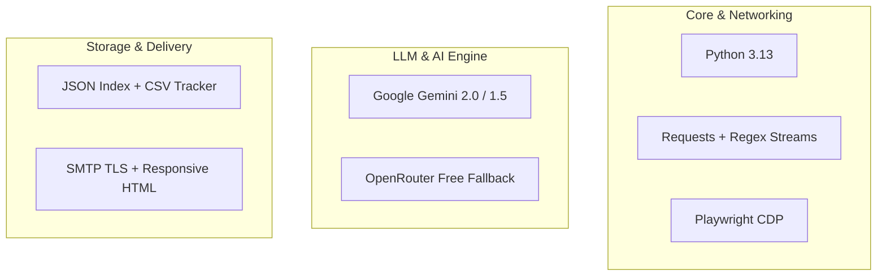
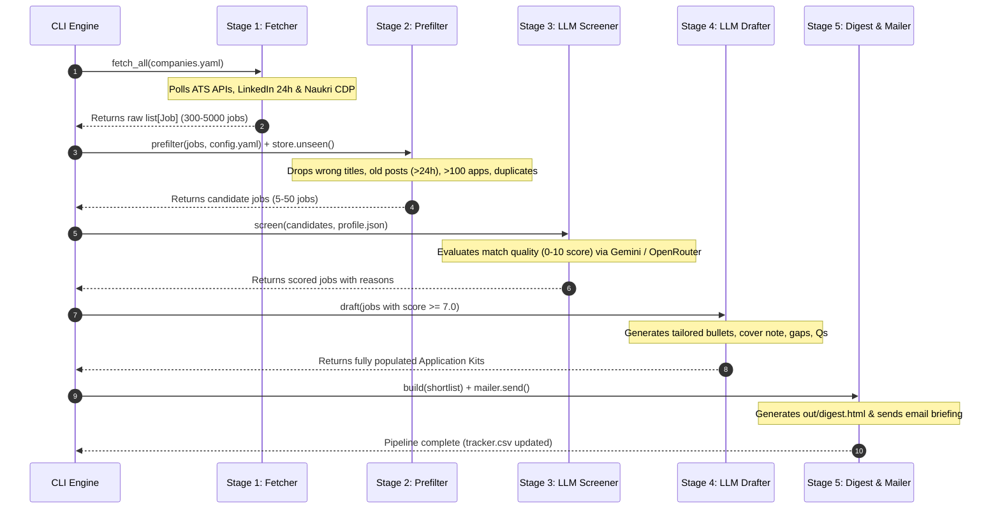
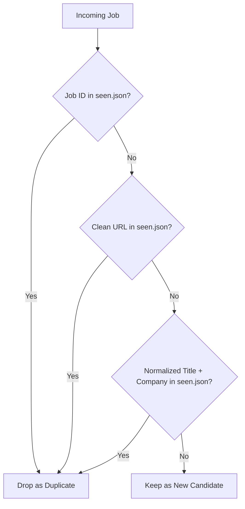

# 🤖 JobHunt AI: Architectural Deep-Dive & Engineering Workflow Specification

> **An autonomous, agentic career intelligence system that discovers, prefilters, screens, drafts application kits, and delivers high-match job opportunities directly to your inbox.**

---

## 📑 Table of Contents
1. [Executive Summary & Problem Statement](#1-executive-summary--problem-statement)
2. [Technology Stack: What Was Used and Why](#2-technology-stack-what-was-used-and-why)
3. [The 5-Stage Agentic Pipeline (Detailed Workflow)](#3-the-5-stage-agentic-pipeline-detailed-workflow)
4. [Deduplication & Multi-Attribute Tracking Algorithm](#4-deduplication--multi-attribute-tracking-algorithm)
5. [Resilience, Error Handling & Failover Architecture](#5-resilience-error-handling--failover-architecture)
6. [Testing & Quality Assurance Strategy](#6-testing--quality-assurance-strategy)
7. [How to Explain This Project (Interview & Technical Presentation Guide)](#7-how-to-explain-this-project-interview--technical-presentation-guide)

---

## 1. Executive Summary & Problem Statement

### The Problem with Traditional Job Searching
Job hunting for software engineers is plagued by three major structural inefficiencies:
1. **High Signal-to-Noise Ratio**: Over 90% of job board postings on aggregator portals are stale (>30 days old), overloaded with hundreds of applicants, or mismatched with candidate seniority.
2. **Platform Fragmentation**: Opportunities are scattered across disparate Applicant Tracking Systems (Greenhouse, Lever, Ashby, Workday, SmartRecruiters) and walled-garden job portals (LinkedIn, Naukri).
3. **Application Fatigue & Generic Submissions**: Manually customizing cover letters, resume bullet points, and interview talking points for every role takes 30–45 minutes per application, leading to burnout and suboptimal submissions.

### The Agentic Solution
**JobHunt AI** acts as a personal top-of-funnel recruiter and application co-pilot. It operates on a strict **Human-in-the-Loop** philosophy: **The agent discovers, filters, evaluates, and drafts; the human reviews, edits, and submits.**

```mermaid
graph LR
    subgraph Data Sources
        ATS[Direct ATS AP
        LI[LinkedIn 24h Feed]
        NK[Naukri CDP Browser]
    end
    
    subgraph JobHunt Engine
        F[Stage 1: Fetcher]
        P[Stage 2: Deterministic Prefilter]
        S[Stage 3: LLM Match Screener]
        D[Stage 4: Application Kit Drafter]
        G[Stage 5: Digest & Dispatch]
    end
    
    subgraph User Delivery
        M[Gmail Digest]
        T[tracker.csv]
    end

    ATS --> F
    LI --> F
    NK --> F
    F --> P
    P --> S
    S --> D
    D --> G
    G --> M
    G --> T
```

---

## 2. Technology Stack: What Was Used and Why

Every technology in JobHunt AI was chosen with deliberate architectural intent: to optimize for **speed, zero recurring cost, resilience against anti-bot systems, and deterministic reliability**.



---

### A. Core Runtime & Language: Python 3.13
* **What was used**: Modern Python 3.13 with native `dataclasses`, strict type hints (`typing.Any`, `Iterable`), and minimal external runtime dependencies.
* **Why it was chosen**: 
  - **Lightweight & Fast**: Avoided heavy frameworks (e.g., Celery, LangChain, or Django) that introduce unnecessary boilerplate and latency.
  - **Clean Domain Models**: Dataclasses like `Job` provide clean serialization (`to_dict()`) and immutability where needed.
  - **Cross-Platform Compatibility**: Executes identically across Windows, Linux, and macOS.

---

### B. Ingestion Layer: Multi-Channel Hybrid Architecture
Instead of treating all job boards as web scraping targets, JobHunt AI segments data acquisition into three distinct tiers:

#### 1. Direct Public ATS APIs (Greenhouse, Lever, Ashby, Workday, SmartRecruiters)
* **What was used**: HTTP `requests` communicating directly with public JSON REST endpoints.
* **Why it was chosen**:
  - **100% Ban-Proof & ToS-Compliant**: Leverages official, unauthenticated candidate-facing APIs exposed by ATS providers for company job boards.
  - **Zero HTML Parsing Overhead**: Receives clean, structured JSON payloads with native compensation, location, and requirement data.
  - **High Throughput**: Can scan 50+ companies in under 3 seconds.

#### 2. Public Guest Feeds with Regex Stream Parsing (LinkedIn)
* **What was used**: Public server-rendered guest search endpoints (`/jobs-guest/jobs/api/seeMoreJobPostings/search`) combined with Python regular expressions (`re.findall`, `re.search`).
* **Why it was chosen**:
  - **No Authentication / Account Risk**: Avoids logging into personal LinkedIn accounts, completely eliminating account ban or session revocation risks.
  - **Strict Freshness Parameters**: Uses native URL parameters (`f_TPR=r86400` for past 24 hours, `sortBy=DD` for newest first) to fetch only brand-new openings.
  - **Sub-Second Execution**: Stream-parsing HTML cards with regex is ~50x faster than booting a full headless browser.

#### 3. Real-Browser CDP Automation (Naukri.com)
* **What was used**: `Playwright` connected via **Chrome DevTools Protocol (CDP)** to an authentic Google Chrome process on port `9222`.
* **Why it was chosen**:
  - **Overcoming Akamai Bot Manager Premier**: Naukri actively detects and blocks standard headless browsers (Puppeteer, Selenium, raw Playwright) with `Access Denied` and Google reCAPTCHA Enterprise (`HTTP 406`).
  - **Genuine Fingerprint Execution**: By connecting to an authentic Chrome instance with real hardware GPU, canvas, and audio fingerprints, the script bypasses all WAF and bot-walls.
  - **Autonomous Lifecycle**: Automatically launches the background Chrome process if not already running, navigates to target queries (e.g., `.NET Developer, 3+ years experience, past 24 hours`), extracts job tuples, and closes the tab.

---

### C. Large Language Model (LLM) Inference & Failover Architecture

#### 1. Primary Engine: Google Gemini (2.0 Flash / 1.5 Flash)
* **What was used**: Google AI Studio REST API using native JSON output formatting (`responseMimeType: application/json`).
* **Why it was chosen**:
  - **Sub-Second Latency**: Gemini Flash models provide near-instant responses for screening and drafting.
  - **Cost-Free Operation**: Operates entirely within the free-tier quota (15 RPM / 1M TPM).
  - **High Token Context Window**: Easily digests complete candidate profiles and long job descriptions without truncation.

#### 2. Backup Engine: OpenRouter Broker (Multi-Model Redundancy)
* **What was used**: OpenRouter API (`openrouter/free`, `nvidia/nemotron-3-super-120b-a12b:free`, `minimax/minimax-m2.7:free`).
* **Why it was chosen**:
  - **Guaranteed Zero Downtime**: When Gemini free quotas hit rate limits (`HTTP 429: Resource Exhausted`), JobHunt AI activates **session-wide failover** to OpenRouter's pool of free models.
  - **Provider-Agnostic Design**: Implemented through a unified `Provider` base class, allowing screening and drafting to switch models dynamically on the fly.

---

### D. Deterministic Pre-Filtering Engine
* **What was used**: Pure Python regex matching, UTC date mathematics (`datetime`, `timedelta`), and configuration dictionaries.
* **Why it was chosen**:
  - **The Economic Equation**: Sending 5,000 raw job listings directly to an LLM is both slow and expensive.
  - **90% Noise Reduction**: Deterministic pre-filtering strips out seniorities (e.g., Staff/Lead/Intern), wrong cities, old postings (>24h), and oversubscribed roles (≥100 applicants) in **under 10 milliseconds at ₹0 cost**.

---

### E. Storage, Deduplication & Tracking
* **What was used**: A JSON storage index (`seen.json`) and automated CSV exporter (`out/tracker.csv`).
* **Why it was chosen**:
  - **Zero Database Infrastructure**: No PostgreSQL, Redis, or SQLite server setup required.
  - **Spreadsheet-Friendly**: The CSV tracker automatically logs every job ever evaluated with its match score, reason, application status, and timestamps—ready to open in Excel or Notion.

---

### F. Email Rendering & Dispatch
* **What was used**: Python standard library `smtplib`, `email.mime`, and responsive inline HTML/CSS.
* **Why it was chosen**:
  - **Direct to Inbox**: Eliminates the need to open web dashboards.
  - **Mobile-Responsive Card Layout**: Formats application kits with color-coded score badges, callout boxes for gaps, and one-click apply buttons that render cleanly in Gmail, Apple Mail, and Outlook.

---

## 3. The 5-Stage Agentic Pipeline (Detailed Workflow)



---

### Stage 1: Multi-Channel Job Ingestion (`jobhunt/fetch.py`)
1. Reads company targets and search definitions from [`companies.yaml`](file:///c:/Users/Akshat/Desktop/JOBHUNT/PWP_jobhunt/companies.yaml).
2. Spawns requests across all configured providers:
   - Hits Greenhouse, Lever, Ashby, Workday (`POST /wday/cxs/...`), SmartRecruiters.
   - Hits LinkedIn 24h guest feeds with rate-limit pacing (`1.0s` sleep).
   - Launches or connects to Chrome CDP on port 9222 to extract Naukri 3+ years .NET postings.
3. Normalizes all raw responses into standard `Job` domain entities:
   - `job_id`: Globally unique namespaced identifier (e.g., `workday:pwc:JR12345`, `naukri:dotnet:98765`).
   - `company`, `title`, `location`, `url`, `description`, `posted_at`, `applicants`.

---

### Stage 2: Deterministic Pre-filtering & Deduplication (`jobhunt/prefilter.py`)
Before spending any LLM tokens, every job must clear four deterministic gates:
1. **Title Inclusion/Exclusion Gate**: Regex checks ensure the title contains core keywords (`\.net`, `c#`, `software engineer`, `developer`) and excludes non-target domains (`frontend`, `manager`, `sales`, `intern`).
2. **Location & Remote Gate**: Matches allowed tech hubs (Bangalore, Hyderabad, Pune, Gurugram, Noida) or remote indicators.
3. **Freshness Gate (`max_age_days: 1`)**: Drops any posting older than 24 hours.
4. **Competition Gate (`max_applicants: 100`)**: Drops any posting that has already crossed 100 applicants.
5. **Deduplication Gate (`store.unseen()`)**: Removes jobs already seen or emailed in previous runs.

---

### Stage 3: LLM Candidate-Job Fit Screening (`jobhunt/llm.py`)
1. Groups surviving jobs into batches of 8 to minimize API round-trips.
2. Sends the candidate's structured profile (`profile.json`) alongside the job batch to the LLM with a strict grading rubric:
   - **9–10**: Direct bullseye on stack, domain, seniority, and architecture.
   - **7–8**: Solid match; core skills overlap well with minor stack differences.
   - **5–6**: Weak match; tangential stack or mismatched expectations.
   - **0–4**: Incompatible or wrong discipline.
3. **Active Failover**: If Gemini returns a 429 rate limit, the system activates `_FAILOVER_ACTIVE = True` and routes the batch through OpenRouter free models without throwing an unhandled exception.

---

### Stage 4: Generative Application Kit Drafting (`jobhunt/llm.py`)
For all roles scoring $\ge 7.0$ (configurable in `config.yaml`), the drafting stage creates a customized application kit:
- **Fit Summary**: 2 sentences summarizing why this position is worth the candidate's time.
- **Tailored Resume Bullets**: 3–4 achievement bullets rewritten specifically for this JD using verified metrics from the profile.
- **Honest Gaps & Mitigation**: Explicitly identifies technologies mentioned in the JD that are absent from the profile and provides speaking points on how to bridge them.
- **Fluff-Free Cover Note**: 120–160 words opening directly with concrete engineering experience (no *"I am excited to apply..."* boilerplate).
- **Strategic Interview Questions**: 2 sharp questions proving the candidate deeply analyzed their architecture.

---

### Stage 5: HTML Digest Generation & Dispatch (`jobhunt/digest.py` & `jobhunt/mailer.py`)
1. Renders an interactive, responsive HTML digest (`out/digest.html`) containing the application kits.
2. Updates `seen.json` and appends full records to `out/tracker.csv`.
3. Dispatches the digest via Gmail SMTP TLS to the user's inbox with the subject:
   `N jobs worth your time — DD Mon YYYY`.

---

## 4. Deduplication & Multi-Attribute Tracking Algorithm

A common failure mode in job aggregators is sending the same job posting multiple times because its URL parameters, session tokens, or ID representations change.

JobHunt AI implements **Triple-Layer Deduplication** in [`jobhunt/store.py`](file:///c:/Users/Akshat/Desktop/JOBHUNT/PWP_jobhunt/jobhunt/store.py):



1. **Layer 1: Canonical Job ID**: Checks if the namespaced ID (`<ats>:<slug>:<id>`) exists in storage.
2. **Layer 2: Clean Base URL**: Strips all transient query parameters (e.g. `?ref=...`, `?src=...`) and checks if the clean URL was previously processed.
3. **Layer 3: Normalized `(Title, Company)` Hash**: Normalizes strings (removing punctuation, casing, and whitespace) to catch identical postings cross-listed under different ATS slugs.

---

## 5. Resilience, Error Handling & Failover Architecture

| Failure Scenario | Built-in Mitigation Strategy |
|---|---|
| **Akamai Bot-Wall on Naukri (`HTTP 406 / Access Denied`)** | Auto-launches authentic Chrome via Playwright CDP (`--remote-debugging-port=9222`), inheriting real browser headers and execution context. |
| **Gemini API Rate Limit (`HTTP 429 Quota Exceeded`)** | `_call_provider_with_fallback` permanently flips session failover to OpenRouter free models (`openrouter/free`, `nvidia/nemotron`, `minimax`), retrying seamlessly. |
| **Dead ATS Slugs or Network Timeout** | `fetch_board` catches all network exceptions per company, logs a single-line notification (`! ats/company -> HTTP 404`), and continues fetching remaining companies. |
| **Malformed LLM Output (Markdown Fences / Trailing Prose)** | `parse_json` strips markdown code fences (` ```json `), finds outermost matching bracket spans (`{...}` or `[...]`), and gracefully parses JSON. |
| **Stale Date Fixtures in Offline Tests** | Test dates are dynamically calculated relative to `now()` (`_ago(1)`), preventing mock suites from randomly failing over time. |

---

## 6. Testing & Quality Assurance Strategy

JobHunt AI includes a comprehensive, automated test suite built with `pytest`:

```bash
.venv/Scripts/python -m pytest
```

### Test Coverage Highlights:
- **`test_parsers.py`**: Validates 100% of parser logic across Greenhouse, Lever, Ashby, Workday, SmartRecruiters, and LinkedIn HTML feeds using native mock JSON/HTML payloads.
- **`test_strip_html.py`**: Verifies entity unescaping and whitespace normalization.
- **`test_prefilter.py`**: Tests title regex matches, remote location detection, and freshness age gates.
- **`test_llm.py`**: Tests JSON parsing resilience against markdown fences, preambles, and malformed replies.

---

## 7. How to Explain This Project (Interview & Technical Presentation Guide)

When discussing JobHunt AI in system design or technical interviews:

### 1. Highlight the Agentic Design Pattern
> *"JobHunt AI uses a multi-stage funnel architecture. Instead of wasting LLM context on thousands of raw web documents, it pairs deterministic, zero-cost rule engines for pre-filtering with specialized generative models for deep semantic reasoning and drafting."*

### 2. Highlight Anti-Bot Engineering
> *"To solve the challenge of enterprise bot-walls on portals like Naukri, I implemented a Chrome DevTools Protocol (CDP) bridge using Playwright that connects to an authentic browser environment, completely bypassing Akamai Premier bot detection and Google reCAPTCHA Enterprise challenges."*

### 3. Highlight Fault-Tolerant LLM Orchestration
> *"I designed a multi-provider fallback architecture. If the primary LLM (Google Gemini) hits free tier rate limits, the system intercepts the exception and automatically switches the active session to OpenRouter free models without losing state or failing the batch."*

---

### Quick Commands Reference

```bash
# Full daily run with email delivery
python -m jobhunt run --send

# Dry run (offline mock fixtures, no API keys needed)
python -m jobhunt run --mock --scorer keyword

# Run test suite
pytest
```
